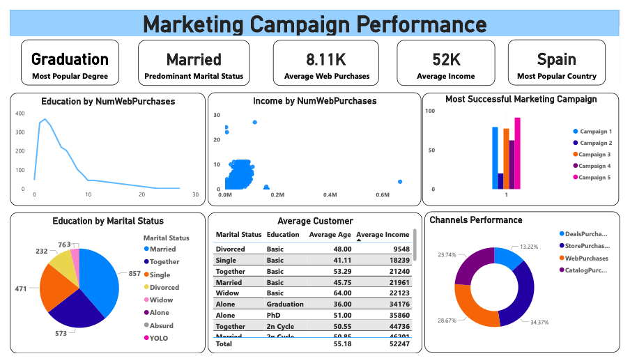

# Marketing Campaign Performance 🎯

The Marketing Campaign Performance Dashboard provides insights into customer purchasing behavior and marketing effectiveness. It analyzes key factors such as education level, marital status, income, and preferred purchasing channels, helping businesses understand their target audience. The dashboard highlights top-performing marketing campaigns, successful sales channels, and country-wise performance, allowing companies to refine their marketing strategies and maximize engagement. By leveraging these insights, businesses can improve campaign targeting and drive higher conversions.

## 📌 Overview  
This **Marketing Campaign Performance Dashboard** analyzes customer data to assess:  
- Most Popular Degree  
- Predominant Marital Status  
- Average Web Purchases & Income  
- Most Successful Marketing Channels  

## 📷 Dashboard Preview  

## 📊 **Key Insights**  
- 🎓 **Most Popular Degree:** Graduation  
- 💍 **Predominant Marital Status:** Married  
- 🛒 **Average Web Purchases:** 8.11K  
- 🌎 **Top Country:** Spain  
- 📈 **Best Marketing Channel:** Catalog Purchases  

## 📂 **Dataset**  
The dataset used for this dashboard is available upon request.  

## 🚀 **How to Use**  
1. Load the dataset into Power BI.  
2. Explore filters for deeper insights.  
3. Use insights to optimize marketing campaigns.  

## 📢 **Next Steps**  
- Identify high-value customers for targeted marketing.  
- Expand successful campaigns to other countries.

